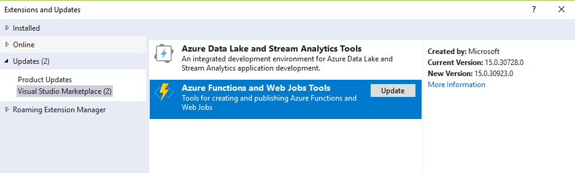

# ghsandbox

Below eachother. We use a new line to ensure they are not on one line.

With bullets. New line not required. Bullets take care of the lines.
* 
* 
* 

With all bullets for images and text. New line not required. Bullets take care of the lines.

* Step 1: do something like this
* 
* Then continue
* 
* And eventually
* 

With bullets for text but not images

* Step 1: do something like this

* Then continue

* And eventually

With no bullets for text but not images

Step 1: do something like this

Then continue

And eventually

With indentation (images)

Step 1: do something like this
  
Then continue
  
And eventually
  

With indentation (text)

  Step 1: do something like this

  Then continue

  And eventually

With indentation (all

  Step 1: do something like this
  
  Then continue
  
  And eventually
  
